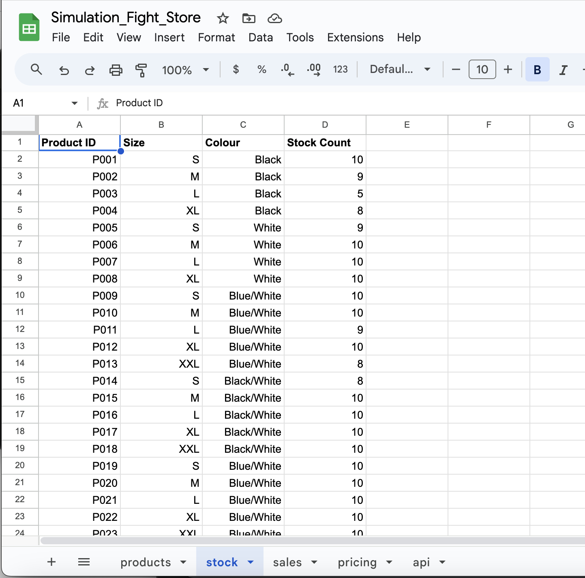
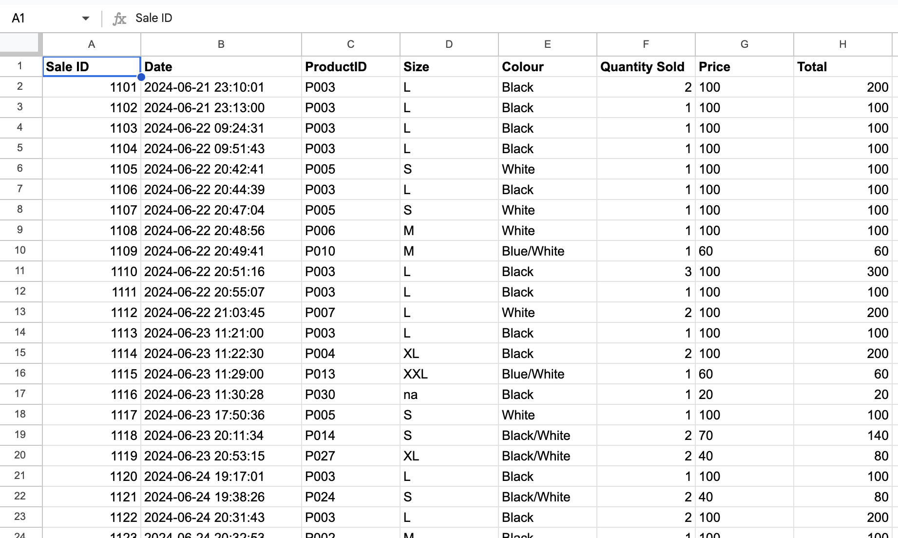
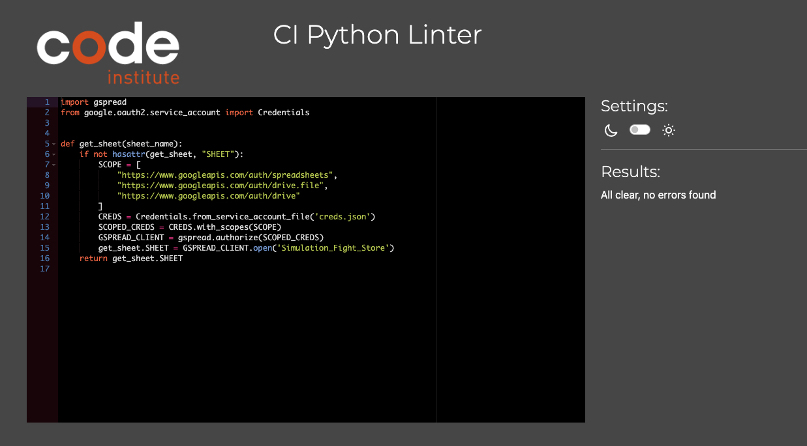
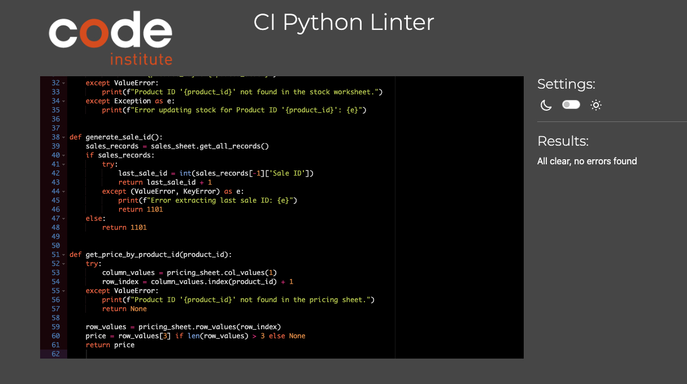
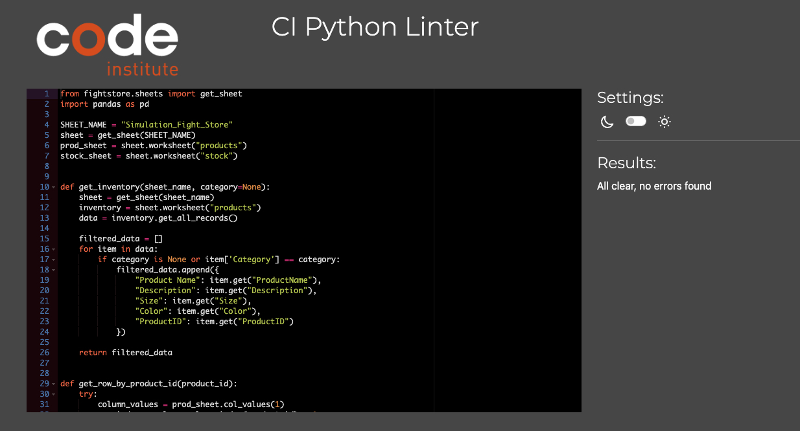
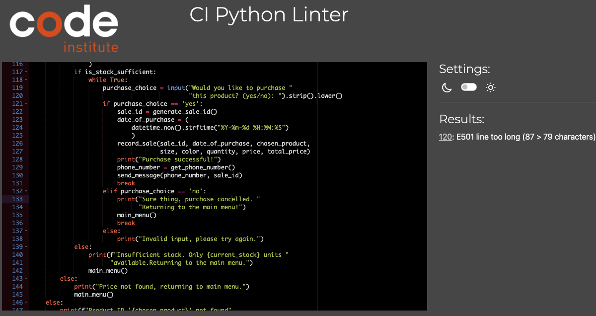

# simulation_fight_store

## Introduction
This is a project I have been working on as part of my PP3 Assignment for Code Institute. This project simulates a command line based clothing store that sells Brazilian JiuJitsu products directly via the command line. Users will have the choice to choose between GI, NO-GI and Misc categories, and have their listed products shown based on the current stock that is updated directly via the program via the Google Sheets API.

Please Read : When using the program via the CLI template on Heroku, there seems to be an issue where input prompts aren't printed to the screen, resulting in the program being buggy. Please review the video below to see that it runs perfectly on a terminal, however the input statements aren't shown on the Command Line template.

https://www.loom.com/share/2a6478c06563492bb908439cf5f9d4a1

## Table of Contents
- [Introduction](#introduction)
- [User Experience](#user-experience)
  - [User Stories](#user-stories)
- [Features](#features)
  - [Existing Features](#existing-features)
  - [Features to be Added](#features-to-be-added)
- [Testing](#testing)
  - [Validation of Code](#validation-of-code)
  - [Manual Testing](#manual-testing)
  - [Bug resolutions](#bugs)
- [Technologies Used](#technologies-used)
- [Deployment](#deployment)
- [Credits](#credits)
- [Acknowledgements](#acknowledgements)

## User Experience
### User Stories
User Goals

- Navigate a simple command line terminal based program to order BJJ clothing.
- Choose between which products they would like, and have the freedom to say yes/no before finishing the order.
- Have a seamless and straight forward experience when deciding and purchasing their clothing.

Site Owner Goals

- Make the program straight forward and easy to use.
- As there is no UI, ensure that the customer knows exactly what they are doing with seamless interaction.
- Update google sheets with all stock changes and sales records
- Ensure error handling is enabled so that customers can not order more than there is available.

## Design
- ASCII Art was added to the welcome message to make the feel a little more UI centric, while also being a straight forward easy to use Command Line program.

## Features

### User choice for category selection

Users have the choice for which category they wish to view with clearly labelled display names, to see which products we offer in each categoyr. A 'back' feature is also added, returning the user to the main menu in the case they want to select a different category.

### Order validation

Orders generate a sale ID which is updated into the sales worksheet of the google sheets page, along with the time and date of the sale.

### WhatsApp order confirmation

Once an order has been processed and confirmed, a WhatsApp message is sent using Bird API with the users order number to confirm their order.

### ASCII Art in the welcome message

The opening welcome message contains ASCII art with the words 'BJJ Fight Store' called from a function in a python file specifically for the ascii art item.

### Error handling

Error handling is present throughout the program to ensure that the information entered by the user matches the expected input type, and help avoid any unexpected outcomes.

### Stock checking

When ordering an item, the stock levels are checked before hand to ensure that there is sufficient stock to fulfill the order and if not, a message is displayed explaining there is not enough stock left.

## Features to be Added
A payment feature would be added to allow the user to be transferred to a payment URL, or via an API like stripe, to allow for the payments to be received from the user before processing.

## Testing

### Validation of Code
-- Sheets.py Validation

-- Sales.py validation

-- Inventory.py validation

-- Main.py Validation

### Manual Testing

Here I have tested all the inputs on my program and logged the results below.

# Manual Testing Document

| Feature Being Tested          | Expected Outcome                                              | Testing Performed                                | Actual Outcome                                      | Result (Pass or Fail) |
|-------------------------------|---------------------------------------------------------------|--------------------------------------------------|-----------------------------------------------------|-----------------------|
| Category input choice      | Each of the options returns the specific category                | Manually checked each input             | Correct category shown each time                        | PASS                  |
| Product choice by index number           | When choosing a product via its index number it updates correctly, and provides an error if not a valid number           | Manually tried each possible product index number           | Each product was used successfully                         | PASS                  |
| 'Back' input to return to main menu           | When input 'back' after viewing a category, you are returned to the main menu | Manually entered this when viewing each category    | Returned to main menu                          | PASS                  |
| yes/no input when confirming purchase     | Entering yes or no should either proceed or cancel the order   | Manually entered both options when proceeding    | Order proceeded or cancelled depending on input            | PASS                  |
| Phone number input validation        | Only a phone number between 9-13 digits with only numbers should be accepted when entering a phone number | Manually 
entered different inputs along with a correct phone number   | Only numbers within that digit range accepted         | PASS                  |
| Convert phone number to string on send message function  | Should convert the phone number to a string so it can be used in the send message function | When entering a number, the use of the 'f' string operator changed the number to a string directly in the function  | Function ran as expected        | PASS                  |
| Correct API response message shown whether message is accepted or rejected  | If a message returns a 202 code, a message stating the message has been successful should be shown.| Sent a message to myself and monitored the response code      | Accepted message shown         | PASS                  |
| Rejected API response message shown | If the response code is not 202, an unsuccessful message should be shown in the terminal | Manually entered an inactive phone number to test this  | Unsuccessful message status shown | PASS                  |

## Bug resolutions

When writing the code for this project I had to over come some bugs that appeared. When creating the ASCII welcome message, I was unable to store the variable correctly. By using r infront of the string to use the raw data of the string, this resolved the issue.

Google sheets also presented some bugs as I was getting used to how this is used. One issue returned was that the index number was shown twice each time a category was selected. To overcome this, after much investigating online, the following addition was added to the print statement that printed the category products '.reset_index(drop=True)' so the full print statement was now print(df_inventory[['Product Name', 'Description', 'Size', 'Color']].reset_index(drop=True)). After this, only one index code per item was shown.

Upon deployment, it appears that the program itself is not working as expected when using the code institute CLI template. I have included a loom recording below showing that the program does work as expected when ran directly in the terminal. Upon further digging, the CLI on heroku appears to not print input statements, while this works perfectly on the gitpod terminal.

https://www.loom.com/share/2a6478c06563492bb908439cf5f9d4a1

## Technologies Used

This project was done using GitPod, Python, Google Sheets API and Bird API for the WhatsApp message sending.

**Cloning the repository**

To clone the repository, you'll need Git installed on your computer. I

Open your terminal or command prompt.
Navigate to the directory where you want to clone the repository.
Run the clone command:

**Forking the repository**

To Fork this repository and have a version of this on your personal account to make changes, customisation and amendments, please do the following.

Go to the GitHub page of the repository : https://github.com/Mickjitsu/simulation_fight_store
Click on the "Fork" button, usually found at the top-right corner of the page.

After forking, you will have a copy of the repository in your GitHub account. You can then clone your forked version to your local machine by following the "Cloning the Repository" steps, using the URL of your fork.

To view the repository on the local machine:

1. Navigate to the Project Directory: : cd //simulation_fight_store

2. Open the project in a code editor like VS code, or via the terminal to interact.

## Deployment

**Deploying on Github Pages**
Firstly clone or fork the repository following the steps above. Once that is done, you will need to set up Heroku:
 Log onto Heroku
   - Connect with your repository
   - Ensure sheets API credentials have been created, then add them to the var files in the settings.
   - Add python and node.js buildpacks.
   - Deploy via the manual deploy button on heroku.

## Credits

The knowledge for google sheets came from the walkthrough project along with the google sheets cheat sheet hosted online below.
https://python.plainenglish.io/master-google-sheets-api-in-python-cheat-sheet-3535e86fbe17

The knowledge of Bird API comes from my line of work and knowledge built up supporting users using the API, along with their developer documentation below.

https://docs.bird.com/api?_gl=1*2nbcnw*_up*MQ..*_ga*MTg5OTU2MzgxMy4xNzE5MjY1MjA4*_ga_2MDYK6FXKB*MTcxOTI2NTIwOC4xLjAuMTcxOTI2NTIwOC4wLjAuMA..
The guidance I had on this was from the current course I am doing on code institute, along with memory of previous courses I have completed on Udemy which helped with the liges of modals.

## Acknowledgements
I would like to thank my partner for encouraging me to continue on when I was struggling at the start of the course, my family for encouraging me to keep studying despite going through a bereavement, and my mentor Matt for helping me along the way with pre, mid point and final calls! This year has been incredibly hard and only seems to be getting harder, however making the time to get this done no matter the issues that I face around me make it all worth while.

[Back to top](#introduction)